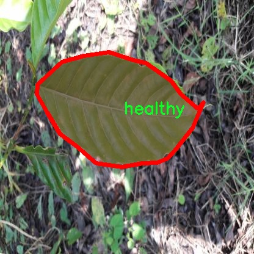

# 植物病害分割系统源码＆数据集分享
 [yolov8-seg-LSKNet＆yolov8-seg-C2f-FocusedLinearAttention等50+全套改进创新点发刊_一键训练教程_Web前端展示]

### 1.研究背景与意义

项目参考[ILSVRC ImageNet Large Scale Visual Recognition Challenge](https://gitee.com/YOLOv8_YOLOv11_Segmentation_Studio/projects)

项目来源[AAAI Global Al lnnovation Contest](https://kdocs.cn/l/cszuIiCKVNis)

研究背景与意义

随着全球气候变化和农业生产方式的转变，植物病害的发生频率和种类日益增加，给农业生产带来了严峻的挑战。植物病害不仅影响作物的生长和产量，还可能导致生态系统的失衡，进而影响食品安全和人类健康。因此，及时、准确地识别和分割植物病害成为现代农业研究中的重要课题。近年来，深度学习技术的快速发展为植物病害的检测和分割提供了新的解决方案，尤其是基于卷积神经网络（CNN）的目标检测和分割模型，如YOLO（You Only Look Once）系列，因其高效性和准确性受到广泛关注。

YOLOv8作为YOLO系列的最新版本，具备了更强的特征提取能力和更快的推理速度，能够在复杂背景下实现高效的目标检测和分割。然而，针对植物病害的特定需求，YOLOv8仍存在一定的局限性。首先，植物病害的种类繁多，且不同病害在视觉特征上可能存在重叠，这使得模型在分类和分割时面临挑战。其次，现有的植物病害数据集往往样本数量有限，难以覆盖所有可能的病害表现，导致模型的泛化能力不足。因此，基于改进YOLOv8的植物病害分割系统的研究显得尤为重要。

本研究所使用的数据集Rocole包含1500张图像，涵盖了6个类别：健康植物、红蜘蛛、不同级别的锈病（从锈病1级到锈病4级）。这一数据集的构建不仅为模型的训练提供了丰富的样本，也为后续的模型评估和验证奠定了基础。通过对这些数据的深入分析，可以帮助我们更好地理解不同植物病害的特征表现，进而优化YOLOv8的结构和参数设置，以提高其在植物病害分割任务中的表现。

本研究的意义在于，通过改进YOLOv8模型，使其更适应植物病害的特征提取和分割需求，不仅能够提高植物病害的检测精度，还能为农业生产提供及时的决策支持。通过建立高效的植物病害分割系统，农民可以更早地识别和处理病害，从而减少农药的使用，降低生产成本，提高作物的产量和质量。此外，该系统的推广应用还将推动智能农业的发展，促进农业的可持续发展。

综上所述，基于改进YOLOv8的植物病害分割系统的研究，不仅具有重要的理论价值，还有着广泛的实际应用前景。通过这一研究，我们期望能够为植物病害的智能识别和精准管理提供新的思路和方法，为现代农业的数字化转型贡献力量。

### 2.图片演示


##### 注意：由于此博客编辑较早，上面“2.图片演示”和“3.视频演示”展示的系统图片或者视频可能为老版本，新版本在老版本的基础上升级如下：（实际效果以升级的新版本为准）

  （1）适配了YOLOV8的“目标检测”模型和“实例分割”模型，通过加载相应的权重（.pt）文件即可自适应加载模型。

  （2）支持“图片识别”、“视频识别”、“摄像头实时识别”三种识别模式。

  （3）支持“图片识别”、“视频识别”、“摄像头实时识别”三种识别结果保存导出，解决手动导出（容易卡顿出现爆内存）存在的问题，识别完自动保存结果并导出到tempDir中。

  （4）支持Web前端系统中的标题、背景图等自定义修改，后面提供修改教程。

  另外本项目提供训练的数据集和训练教程,暂不提供权重文件（best.pt）,需要您按照教程进行训练后实现图片演示和Web前端界面演示的效果。

### 3.视频演示

[3.1 视频演示](https://www.bilibili.com/video/BV1Zw1LYdEVb/)

### 4.数据集信息展示

##### 4.1 本项目数据集详细数据（类别数＆类别名）

nc: 6
names: ['healthy', 'red_spider_mite', 'rust_level_1', 'rust_level_2', 'rust_level_3', 'rust_level_4']


##### 4.2 本项目数据集信息介绍

数据集信息展示

在植物病害检测与分割领域，准确的标注和丰富的数据集是实现高效模型训练的关键。为此，本研究采用了名为“Rocole”的数据集，以支持对YOLOv8-seg模型的改进与优化。该数据集专注于植物病害的分割任务，特别是针对特定植物病害的细致分类，旨在提高模型在实际应用中的表现。

“Rocole”数据集包含六个主要类别，涵盖了从健康植物到不同程度的病害表现，具体类别包括：健康植物、红蜘蛛、以及五个不同级别的锈病（rust），分别为锈病等级1至锈病等级4。这种细致的分类设计使得模型不仅能够识别出植物的健康状态，还能对不同病害进行分级，这对于农作物的管理和病害防治具有重要的现实意义。

健康植物类别代表了没有病害的理想状态，作为模型训练的基准，帮助模型学习到正常植物的特征和外观。红蜘蛛则是常见的植物害虫之一，其对植物的危害往往导致叶片变色和脱落，识别这一类别对于及时采取防治措施至关重要。锈病是由真菌引起的一种植物病害，通常表现为叶片上出现锈色斑点，随着病情的发展，病斑会逐渐扩大并导致植物生长受阻。通过将锈病分为四个等级，数据集不仅提供了不同病害严重程度的视觉特征，还为模型提供了更丰富的学习样本，帮助其在实际应用中做出更为精准的判断。

在数据集的构建过程中，Rocole团队对每个类别进行了严格的标注和分类，确保每一张图像都能准确反映出植物的健康状态或病害表现。这种高质量的标注不仅提高了数据集的可信度，也为后续的模型训练提供了坚实的基础。此外，数据集中的图像涵盖了多种植物种类和生长环境，确保了模型在不同场景下的泛化能力。

在训练YOLOv8-seg模型时，Rocole数据集的多样性和丰富性将极大地提升模型的学习效果。通过对健康植物和不同病害的准确分割，模型能够更好地理解植物生长的动态变化，并及时识别出潜在的病害风险。这不仅有助于提高农作物的产量和质量，也为农业生产的智能化和自动化提供了有力支持。

综上所述，Rocole数据集以其细致的分类和高质量的标注，为改进YOLOv8-seg的植物病害分割系统提供了宝贵的资源。通过充分利用这一数据集，研究人员能够开发出更为精准和高效的病害检测模型，推动农业智能化的发展进程，最终实现更高效的植物保护和管理。





### 5.全套项目环境部署视频教程（零基础手把手教学）

[5.1 环境部署教程链接（零基础手把手教学）](https://www.bilibili.com/video/BV1jG4Ve4E9t/?vd_source=bc9aec86d164b67a7004b996143742dc)


[5.2 安装Python虚拟环境创建和依赖库安装视频教程链接（零基础手把手教学）](https://www.bilibili.com/video/BV1nA4VeYEze/?vd_source=bc9aec86d164b67a7004b996143742dc)

### 6.手把手YOLOV8-seg训练视频教程（零基础小白有手就能学会）

[6.1 手把手YOLOV8-seg训练视频教程（零基础小白有手就能学会）](https://www.bilibili.com/video/BV1cA4VeYETe/?vd_source=bc9aec86d164b67a7004b996143742dc)


按照上面的训练视频教程链接加载项目提供的数据集，运行train.py即可开始训练



     Epoch   gpu_mem       box       obj       cls    labels  img_size
     1/200     0G   0.01576   0.01955  0.007536        22      1280: 100%|██████████| 849/849 [14:42<00:00,  1.04s/it]
               Class     Images     Labels          P          R     mAP@.5 mAP@.5:.95: 100%|██████████| 213/213 [01:14<00:00,  2.87it/s]
                 all       3395      17314      0.994      0.957      0.0957      0.0843

     Epoch   gpu_mem       box       obj       cls    labels  img_size
     2/200     0G   0.01578   0.01923  0.007006        22      1280: 100%|██████████| 849/849 [14:44<00:00,  1.04s/it]
               Class     Images     Labels          P          R     mAP@.5 mAP@.5:.95: 100%|██████████| 213/213 [01:12<00:00,  2.95it/s]
                 all       3395      17314      0.996      0.956      0.0957      0.0845

     Epoch   gpu_mem       box       obj       cls    labels  img_size
     3/200     0G   0.01561    0.0191  0.006895        27      1280: 100%|██████████| 849/849 [10:56<00:00,  1.29it/s]
               Class     Images     Labels          P          R     mAP@.5 mAP@.5:.95: 100%|███████   | 187/213 [00:52<00:00,  4.04it/s]
                 all       3395      17314      0.996      0.957      0.0957      0.0845


### 7.50+种全套YOLOV8-seg创新点代码加载调参视频教程（一键加载写好的改进模型的配置文件）

[7.1 50+种全套YOLOV8-seg创新点代码加载调参视频教程（一键加载写好的改进模型的配置文件）](https://www.bilibili.com/video/BV1Hw4VePEXv/?vd_source=bc9aec86d164b67a7004b996143742dc)

### 8.YOLOV8-seg图像分割算法原理

原始YOLOv8-seg算法原理

YOLOv8-seg是Ultralytics团队在YOLO系列的基础上推出的一种新型目标检测与分割算法。该算法不仅继承了YOLO系列模型的高效性和实时性，还通过引入一系列创新设计，显著提升了模型在目标分割任务中的表现。YOLOv8-seg的核心在于其独特的网络结构和训练策略，这些设计旨在提高模型的特征提取能力和预测精度，同时保持较低的计算复杂度。

首先，YOLOv8-seg在输入端采用了自适应数据增强技术，尤其是针对Mosaic数据增强的改进。尽管Mosaic增强在提升模型鲁棒性方面表现良好，但其在某些情况下可能会破坏数据的真实分布，导致模型学习到不良信息。因此，YOLOv8-seg在训练的最后阶段停止使用Mosaic增强，以确保模型在真实场景中的表现更加可靠。这一策略的引入，反映了YOLOv8-seg对数据质量的重视，旨在通过优化数据输入来提升模型的整体性能。

在网络结构方面，YOLOv8-seg对主干网络进行了重要的改进。传统的C3模块被更为先进的C2f模块所替代。C2f模块的设计灵感来源于YOLOv7中的ELAN结构，增加了更多的跳层连接，这使得模型能够获得更丰富的梯度流信息。通过这种方式，YOLOv8-seg能够在特征提取过程中更好地捕捉到不同层次的特征，进而提升模型的表达能力。此外，YOLOv8-seg依然保留了SPPF（Spatial Pyramid Pooling Fusion）模块，该模块在保证效果的同时，显著减少了执行时间，从而提高了模型的推理速度。

在颈部网络的设计上，YOLOv8-seg同样进行了优化，所有的C3模块都被更换为C2f模块，并且在上采样之前的卷积连接层数量被减少。这一设计不仅提高了特征融合的效率，还增强了模型对不同尺度目标的检测能力。通过路径聚合网络（PAN）的引入，YOLOv8-seg能够更好地处理多尺度特征，从而在复杂场景中保持较高的检测精度。

YOLOv8-seg的头部网络采用了与YOLOX相似的解耦头设计，将分类和定位任务分开处理。这种设计使得模型在处理不同任务时能够更专注于各自的特征提取，从而提高了收敛速度和预测精度。具体而言，分类任务侧重于分析特征图中的特征与已有类别的相似性，而定位任务则关注边界框与真实框之间的位置关系。这种侧重点的不同，使得模型在处理复杂场景时，能够更有效地进行目标检测与分割。

在无锚框结构的引入方面，YOLOv8-seg直接预测目标的中心点，并通过任务对齐学习（Task Alignment Learning, TAL）来区分正负样本。这一策略不仅简化了模型的设计，还提高了预测的准确性。YOLOv8-seg在损失函数的设计上也进行了创新，结合了分类分数和IOU的高次幂乘积作为衡量任务对齐程度的指标，从而确保模型在分类和定位任务中都能获得良好的表现。

YOLOv8-seg在检测结果上也取得了显著的进展。通过在COCO数据集上的测试，YOLOv8-seg在不同尺寸的模型中，参数量并未显著增加的情况下，取得了更高的精度。这一成果表明，YOLOv8-seg在设计上实现了高效性与准确性的良好平衡。此外，YOLOv8-seg在推理速度上也表现出色，相较于其他YOLO系列模型，在相同尺寸下实现了更快的推理速度，且精度保持在较高水平。

综上所述，YOLOv8-seg通过一系列创新设计，特别是在网络结构、数据增强和损失函数等方面的改进，显著提升了目标检测与分割的性能。其高效的特征提取能力和实时的推理速度，使得YOLOv8-seg在实际应用中具有广泛的前景，尤其是在需要快速响应和高精度的场景中，如自动驾驶、智能监控和机器人视觉等领域。随着YOLOv8-seg的不断发展和完善，未来在目标检测与分割任务中的应用将更加广泛，为相关领域带来新的技术突破和应用机会。


### 9.系统功能展示（检测对象为举例，实际内容以本项目数据集为准）

图9.1.系统支持检测结果表格显示

  图9.2.系统支持置信度和IOU阈值手动调节

  图9.3.系统支持自定义加载权重文件best.pt(需要你通过步骤5中训练获得)

  图9.4.系统支持摄像头实时识别

  图9.5.系统支持图片识别

  图9.6.系统支持视频识别

  图9.7.系统支持识别结果文件自动保存

  图9.8.系统支持Excel导出检测结果数据


### 10.50+种全套YOLOV8-seg创新点原理讲解（非科班也可以轻松写刊发刊，V11版本正在科研待更新）

#### 10.1 由于篇幅限制，每个创新点的具体原理讲解就不一一展开，具体见下列网址中的创新点对应子项目的技术原理博客网址【Blog】：


[10.1 50+种全套YOLOV8-seg创新点原理讲解链接](https://gitee.com/qunmasj/good)

#### 10.2 部分改进模块原理讲解(完整的改进原理见上图和技术博客链接)【如果此小节的图加载失败可以通过CSDN或者Github搜索该博客的标题访问原始博客，原始博客图片显示正常】

### YOLOv8简介
继YOLOv5之后,Ultralytics公司在2023年1月发布了YOLOv8,该版本可以用于执行目标检测、实例分割和图像分类任务。整个网络结构由4部分组成:输入图像, Backbone主干网络获得图像的特征图, Head检测头预测目标对象和位置, Neck融合不同层的特征并将图像特征传递到预测层。
1)相比于YOLOv5和 YOLOv7算法,YOLOv8在训练时间和检测精度上得到极大提升,而且模型的权重文件只有6 MB,可以部署到任一嵌入式设备中,它凭借自身快速、高效的性能可以很好地满足实时检测的需求。
2)由于YOLOv8算法是YOLOv5的继承版本，对应提供了N、S、 M、L、X 等不同尺度的模型,用于满足不同场景的需求,在精度得到大幅提升的同时,能流畅地训练,并且能安装在各种硬件平台上运行。
3)在输入端,YOLOv8算法使用了Mosaic数据增强[15]、自适应锚框计算[16]等方法。Mosaic数据增强是通过随机缩放、随机裁剪、随机排布的方式进行拼接,丰富检测数据集。自适应锚框计算是网络在初始锚框的基础上输出预测框,通过差值计算、反向更新等操作计算出最佳锚框值。
4)在输出端,YOLOv8算法使用解耦头替换了以往的耦合头,将分类和回归解耦为两个独立的分支,通过解耦使各个任务更加专注,从而解决复杂场景下定位不准及分类错误的问题。


### OREPA：在线卷积重参数化
卷积神经网络(CNNs)已经在许多计算机视觉任务的应用成功，包括图像分类、目标检测、语义分割等。精度和模型效率之间的权衡也已被广泛讨论。

一般来说，一个精度较高的模型通常需要一个更复杂的块，一个更宽或更深的结构。然而，这样的模型总是太重，无法部署，特别是在硬件性能有限、需要实时推理的场景下。考虑到效率，更小、更紧凑和更快的模型自然是首选。

为了获得一个部署友好且高精度的模型，有研究者提出了基于结构重参数化的方法来释放性能。在这些方法中，模型在训练阶段和推理阶段有不同的结构。具体来说，使用复杂的训练阶段拓扑，即重参数化的块，来提高性能。训练结束后，通过等效变换将一个复杂的块重参为成一个单一的线性层。重参后的模型通常具有一个整洁架构模型，例如，通常是一个类似VGG的或一个类似ResNet的结构。从这个角度来看，重参化策略可以在不引入额外的推理时间成本的情况下提高模型的性能。


BN层是重构模型的关键组成部分。在一个重新解析块(图1(b))中，在每个卷积层之后立即添加一个BN层。可以观察到，去除这些BN层会导致的性能退化。然而，当考虑到效率时，这种BN层的使用出乎意料地在训练阶段带来了巨大的计算开销。在推理阶段，复杂的块可以被压缩成一个卷积层。但是，在训练过程中，BN层是非线性的，也就是说，它们将特征映射除以它的标准差，这就阻止了合并整个块。因此，存在大量的中间计算操作(large FLOPS)和缓冲特征映射(high memory usage)。更糟糕的是，这么高的训练预算使得很难探索更复杂和可能更强的重参块。很自然地，下面的问题就出现了：

为什么标准化在重参中这么重要？

通过分析和实验，作者认为BN层中的尺度因子最重要，因为它们能够使不同分支的优化方向多样化。

基于观察结果，作者提出了在线重参化(OREPA)(图1(c))，这是一个两阶段的pipeline，使之能够简化复杂的training-time re-param block。

在第一阶段，block linearization，去除所有的非线性BN层，并引入线性缩放层。这些层与BN层具有相似的性质，因此它们使不同分支的优化多样化。此外，这些层都是线性的，可以在训练过程中合并成卷积层。

第二阶段，block squeezing，将复杂的线性块简化为单一的卷积层。OREPA通过减少由中间计算层引起的计算和存储开销，显著降低了训练成本，对性能只有非常小的影响。

此外，高效化使得探索更复杂的重参化拓扑成为可能。为了验证这一点，作者进一步提出了几个重参化的组件，以获得更好的性能。

在ImageNet分类任务上评估了所提出的OREPA。与最先进的修复模型相比，OREPA将额外的训练时间GPU内存成本降低了65%到75%，并将训练过程加快了1.5-2.3倍。同时，OREPA-ResNet和OREPA-VGG的性能始终优于+0.2%∼+0.6%之前的DBB和RepVGG方法。同时作者还评估了在下游任务上的OREPA，即目标检测和语义分割。作者发现OREPA可以在这些任务上也可以带来性能的提高。

提出了在线卷积重参化(OREPA)策略，这极大地提高了重参化模型的训练效率，并使探索更强的重参化块成为可能；

通过对重参化模型工作机制的分析，用引入的线性尺度层代替BN层，这仍然提供了不同的优化方向，并保持了表示能力;

在各种视觉任务上的实验表明，OREPA在准确性和训练效率方面都优于以前的重参化模型(DBB/RepVGG)。


#### 结构重参化
结构重参化最近被重视并应用于许多计算机视觉任务，如紧凑模型设计、架构搜索和剪枝。重参化意味着不同的架构可以通过参数的等价转换来相互转换。例如，1×1卷积的一个分支和3×3卷积的一个分支，可以转移到3×3卷积的单个分支中。在训练阶段，设计了多分支和多层拓扑来取代普通的线性层(如conv或全连接层)来增强模型。Cao等讨论了如何在训练过程中合并深度可分离卷积核。然后在推理过程中，将训练时间的复杂模型转移到简单模型中，以便于更快的推理。

在受益于复杂的training-time拓扑，同时，当前的重参化方法训练使用不可忽略的额外计算成本。当块变得更复杂以变得更强的表示时，GPU内存利用率和训练时间将会越来越长，最终走向不可接受。与以往的重参化方法不同，本文更多地关注训练成本。提出了一种通用的在线卷积重参化策略，使training-time的结构重参化成为可能。


#### Normalization
BN被提出来缓解训练非常深度神经网络时的梯度消失问题。人们认为BN层是非常重要的，因为它们平滑了损失。最近关于无BN神经网络的研究声称，BN层并不是不可或缺的。通过良好的初始化和适当的正则化，可以优雅地去除BN层。

对于重参化模型，作者认为重参化块中的BN层是关键的。无BN的变体将会出现性能下降。然而，BN层是非线性的，也就是说，它们将特征图除以它的标准差，这阻止了在线合并块。为了使在线重参化可行，作者去掉了重参块中的所有BN层，并引入了BN层的线性替代方法，即线性缩放层。

#### 卷积分解
标准卷积层计算比较密集，导致大的FLOPs和参数量。因此，卷积分解方法被提出，并广泛应用于移动设备的轻量化模型中。重参化方法也可以看作是卷积分解的某种形式，但它更倾向于更复杂的拓扑结构。本文的方法的不同之处在于，在kernel-level上分解卷积，而不是在structure level。

#### 在线重参化
在本节中，首先，分析了关键组件，即重参化模型中的BN层，在此基础上提出了在线重参化(OREPA)，旨在大大减少再参数化模型的训练时间预算。OREPA能够将复杂的训练时间块简化为一个卷积层，并保持了较高的精度。

OREPA的整体pipeline如图所示，它包括一个Block Linearization阶段和一个Block Squeezing阶段。


参考该博客通过分析多层和多分支结构的优化多样性，深入研究了重参化的有效性，并证明了所提出的线性缩放层和BN层具有相似的效果。

最后，随着训练预算的减少，进一步探索了更多的组件，以实现更强的重参化模型，成本略有增加。

#### 重参化中的Normalization
作者认为中间BN层是重参化过程中多层和多分支结构的关键组成部分。以SoTA模型DBB和RepVGG为例，去除这些层会导致严重的性能下降，如表1所示。


这种观察结果也得到了Ding等人的实验支持。因此，作者认为中间的BN层对于重参化模型的性能是必不可少的。

然而，中间BN层的使用带来了更高的训练预算。作者注意到，在推理阶段，重参化块中的所有中间操作都是线性的，因此可以合并成一个卷积层，从而形成一个简单的结构。

但在训练过程中，BN层是非线性的，即它们将特征映射除以其标准差。因此，中间操作应该单独计算，这将导致更高的计算和内存成本。更糟糕的是，如此高的成本将阻止探索更强大的训练模块。

#### Block Linearization
如3.1中所述，中间的BN层阻止了在训练过程中合并单独的层。然而，由于性能问题，直接删除它们并不简单。为了解决这一困境，作者引入了channel级线性尺度操作作为BN的线性替代方法。

缩放层包含一个可学习的向量，它在通道维度中缩放特征映射。线性缩放层具有与BN层相似的效果，它们都促进多分支向不同的方向进行优化，这是重参化时性能提高的关键。除了对性能的影响外，线性缩放层还可以在训练过程中进行合并，使在线重参化成为可能。


基于线性缩放层，作者修改了重参化块，如图所示。具体来说，块的线性化阶段由以下3个步骤组成：

首先，删除了所有的非线性层，即重参化块中的BN层

其次，为了保持优化的多样性，在每个分支的末尾添加了一个缩放层，这是BN的线性替代方法

最后，为了稳定训练过程，在所有分支的添加后添加一个BN层。

一旦完成线性化阶段，在重参化块中只存在线性层，这意味着可以在训练阶段合并块中的所有组件。

#### Block Squeezing
Block Squeezing步骤将计算和内存昂贵的中间特征映射上的操作转换为更经济的kernel上的操作。这意味着在计算和内存方面从减少到，其中、是特征图和卷积核的空间尺寸。

一般来说，无论线性重参化块是多么复杂，以下2个属性始终成立：

Block中的所有线性层，例如深度卷积、平均池化和所提出的线性缩放，都可以用带有相应参数的退化卷积层来表示;

Block可以由一系列并行分支表示，每个分支由一系列卷积层组成。

有了上述两个特性，如果可以将

多层（即顺序结构）

多分支（即并行结构）

简化为单一卷积，就可以压缩一个块。在下面的部分中，将展示如何简化顺序结构(图(a))和并行结构(图(b))。


### 11.项目核心源码讲解（再也不用担心看不懂代码逻辑）

#### 11.1 ultralytics\data\annotator.py

以下是经过精简和详细注释的核心代码部分：

```python
# 导入必要的库
from pathlib import Path
from ultralytics import SAM, YOLO

def auto_annotate(data, det_model='yolov8x.pt', sam_model='sam_b.pt', device='', output_dir=None):
    """
    自动为图像添加注释，使用YOLO目标检测模型和SAM分割模型。

    参数:
        data (str): 包含待注释图像的文件夹路径。
        det_model (str, optional): 预训练的YOLO检测模型，默认为'yolov8x.pt'。
        sam_model (str, optional): 预训练的SAM分割模型，默认为'sam_b.pt'。
        device (str, optional): 模型运行的设备，默认为空字符串（使用CPU或可用的GPU）。
        output_dir (str | None | optional): 保存注释结果的目录，默认为与'data'相同目录下的'labels'文件夹。

    示例:
        auto_annotate(data='ultralytics/assets', det_model='yolov8n.pt', sam_model='mobile_sam.pt')
    """
    # 加载YOLO检测模型和SAM分割模型
    det_model = YOLO(det_model)  # 初始化YOLO模型
    sam_model = SAM(sam_model)    # 初始化SAM模型

    # 将数据路径转换为Path对象
    data = Path(data)
    
    # 如果未指定输出目录，则创建一个默认输出目录
    if not output_dir:
        output_dir = data.parent / f'{data.stem}_auto_annotate_labels'  # 生成输出目录路径
    Path(output_dir).mkdir(exist_ok=True, parents=True)  # 创建输出目录（如果不存在）

    # 使用YOLO模型进行目标检测
    det_results = det_model(data, stream=True, device=device)

    # 遍历检测结果
    for result in det_results:
        class_ids = result.boxes.cls.int().tolist()  # 获取检测到的类别ID
        if len(class_ids):  # 如果检测到的类别不为空
            boxes = result.boxes.xyxy  # 获取边界框坐标
            # 使用SAM模型进行分割，传入边界框
            sam_results = sam_model(result.orig_img, bboxes=boxes, verbose=False, save=False, device=device)
            segments = sam_results[0].masks.xyn  # 获取分割结果

            # 将分割结果写入文本文件
            with open(f'{str(Path(output_dir) / Path(result.path).stem)}.txt', 'w') as f:
                for i in range(len(segments)):
                    s = segments[i]  # 获取第i个分割结果
                    if len(s) == 0:  # 如果分割结果为空，则跳过
                        continue
                    segment = map(str, segments[i].reshape(-1).tolist())  # 将分割结果转换为字符串
                    f.write(f'{class_ids[i]} ' + ' '.join(segment) + '\n')  # 写入类别ID和分割结果
```

### 代码核心部分分析：
1. **模型加载**：通过`YOLO`和`SAM`类加载预训练的目标检测和分割模型。
2. **路径处理**：使用`Path`库处理文件路径，确保输出目录的创建。
3. **目标检测**：调用YOLO模型对输入数据进行目标检测，返回检测结果。
4. **分割处理**：对于每个检测结果，提取边界框并使用SAM模型进行图像分割。
5. **结果保存**：将分割结果和对应的类别ID写入文本文件，便于后续使用。

这段代码的核心功能是自动为图像中的对象添加注释，结合了目标检测和图像分割技术。

这个文件是一个用于自动标注图像的程序，主要依赖于YOLO（You Only Look Once）目标检测模型和SAM（Segment Anything Model）分割模型。其核心功能是读取指定文件夹中的图像，利用YOLO模型检测出图像中的目标，并使用SAM模型对这些目标进行分割，最终将结果保存为文本文件。

程序的入口函数是`auto_annotate`，它接受几个参数。第一个参数`data`是一个字符串，表示包含待标注图像的文件夹路径。`det_model`和`sam_model`分别是YOLO和SAM的预训练模型的路径，默认值分别为'yolov8x.pt'和'sam_b.pt'。`device`参数用于指定运行模型的设备（如CPU或GPU），如果为空则默认使用可用的设备。`output_dir`参数指定了保存标注结果的目录，如果未提供，则会在`data`目录下创建一个名为`{data.stem}_auto_annotate_labels`的文件夹。

在函数内部，首先加载YOLO和SAM模型。接着，使用`Path`模块处理文件路径，确保输出目录存在。然后，调用YOLO模型对指定的图像数据进行检测，返回检测结果。

对于每个检测结果，程序提取出目标的类别ID和边界框坐标。如果检测到目标，程序会使用SAM模型对这些边界框进行分割，获取分割结果。分割结果以坐标的形式存储。最后，程序将每个目标的类别ID和对应的分割坐标写入一个文本文件，文件名与原图像文件名相同，但后缀为`.txt`。

总体而言，这段代码实现了一个完整的自动标注流程，能够高效地处理图像并生成相应的标注文件，适用于需要大量图像标注的场景。

#### 11.2 ultralytics\models\sam\modules\__init__.py

以下是代码的核心部分，并附上详细的中文注释：

```python
# Ultralytics YOLO 🚀, AGPL-3.0 license

# 导入必要的库
import torch  # 导入PyTorch库，用于深度学习模型的构建和训练

# 定义YOLO模型类
class YOLO:
    def __init__(self, model_path):
        # 初始化YOLO模型
        self.model = torch.load(model_path)  # 加载预训练的YOLO模型

    def predict(self, image):
        # 对输入图像进行预测
        with torch.no_grad():  # 在推理时不需要计算梯度
            predictions = self.model(image)  # 使用模型对图像进行预测
        return predictions  # 返回预测结果

# 示例：如何使用YOLO模型进行预测
if __name__ == "__main__":
    yolo_model = YOLO('path/to/model.pt')  # 创建YOLO模型实例并加载模型
    image = torch.randn(1, 3, 640, 640)  # 创建一个随机图像张量，模拟输入
    results = yolo_model.predict(image)  # 调用预测方法
    print(results)  # 输出预测结果
```

### 注释说明：
1. **导入库**：导入了PyTorch库，这是深度学习的基础库，用于构建和训练模型。
2. **YOLO类**：定义了一个YOLO类，用于封装模型的加载和预测功能。
3. **初始化方法**：在初始化方法中，加载了预训练的YOLO模型，模型路径作为参数传入。
4. **预测方法**：定义了一个预测方法，接收输入图像并返回模型的预测结果。在推理过程中使用`torch.no_grad()`来避免计算梯度，从而节省内存和提高速度。
5. **示例代码**：在主程序中，创建YOLO模型实例并加载模型，生成一个随机图像作为输入，调用预测方法并输出结果。

这个文件是Ultralytics YOLO项目的一部分，具体位于`ultralytics/models/sam/modules/__init__.py`。文件的开头包含了一行注释，表明该项目使用的是AGPL-3.0许可证，并且与Ultralytics YOLO相关。AGPL-3.0是一种开源许可证，允许用户自由使用、修改和分发软件，但要求在分发修改后的版本时也必须以相同的许可证发布。

由于该文件的代码非常简短，仅包含一行注释，因此可以推测这个`__init__.py`文件的主要作用是将其所在的目录标识为一个Python包。Python中的`__init__.py`文件通常用于初始化包的命名空间，并可以包含包的初始化代码或导入其他模块。

在这个特定的上下文中，虽然没有具体的功能实现，但可以推测这个模块可能会在更大的YOLO模型架构中扮演重要角色，尤其是在处理与SAM（Segment Anything Model）相关的功能时。整体而言，这个文件是Ultralytics YOLO项目结构的一部分，帮助组织和管理相关的模块和功能。

#### 11.3 ultralytics\models\fastsam\__init__.py

以下是代码中最核心的部分，并附上详细的中文注释：

```python
# 导入必要的模块和类
from .model import FastSAM  # 从当前包中导入 FastSAM 模型类
from .predict import FastSAMPredictor  # 从当前包中导入 FastSAMPredictor 类，用于预测
from .prompt import FastSAMPrompt  # 从当前包中导入 FastSAMPrompt 类，用于处理提示
from .val import FastSAMValidator  # 从当前包中导入 FastSAMValidator 类，用于验证

# 定义模块的公开接口，允许外部访问这些类
__all__ = 'FastSAMPredictor', 'FastSAM', 'FastSAMPrompt', 'FastSAMValidator'
```

### 注释说明：
1. **导入模块**：代码通过 `from .module import ClassName` 的方式导入了当前包中的几个类，这些类分别用于模型定义、预测、提示处理和验证。
2. **`__all__` 变量**：该变量定义了模块的公共接口，指定了当使用 `from module import *` 时，哪些类会被导入。这是一个良好的编程习惯，有助于控制模块的可见性。

这个程序文件是一个Python模块的初始化文件，文件名为`__init__.py`，它位于`ultralytics\models\fastsam`目录下。该文件的主要作用是定义模块的公共接口，并导入相关的类或函数，以便在其他地方使用。

首先，文件开头有一行注释，提到这是Ultralytics YOLO项目的一部分，并且该项目遵循AGPL-3.0许可证。这表明该项目是开源的，并且使用了特定的许可证条款。

接下来，文件通过`from ... import ...`语句导入了四个组件：`FastSAM`、`FastSAMPredictor`、`FastSAMPrompt`和`FastSAMValidator`。这些组件分别来自于同一目录下的不同模块文件。具体来说：

- `FastSAM`：可能是一个模型类，用于实现FastSAM算法的核心功能。
- `FastSAMPredictor`：这个类可能负责执行预测任务，利用FastSAM模型进行推断。
- `FastSAMPrompt`：这个类可能与用户输入或提示相关，提供与模型交互的功能。
- `FastSAMValidator`：这个类可能用于验证模型的性能或准确性，确保模型在特定数据集上的表现。

最后，`__all__`变量定义了模块的公共接口，包含了四个导入的类名。这意味着当使用`from ultralytics.models.fastsam import *`这样的语句时，只会导入这些指定的类，而不会导入模块中的其他内容。这是一种封装和控制模块可见性的方式。

总体而言，这个初始化文件的主要功能是组织和暴露FastSAM相关的功能，使得其他模块或用户能够方便地使用这些类。

#### 11.4 ultralytics\utils\checks.py

以下是代码中最核心的部分，并附上详细的中文注释：

```python
import os
import platform
import subprocess
import sys
from pathlib import Path
from typing import Optional

import torch
from ultralytics.utils import LOGGER, ROOT, SimpleNamespace, parse_requirements

def check_python(minimum: str = '3.8.0') -> bool:
    """
    检查当前Python版本是否满足最低要求。

    参数:
        minimum (str): 所需的最低Python版本。

    返回:
        bool: 如果当前版本满足要求则返回True，否则返回False。
    """
    current_version = platform.python_version()  # 获取当前Python版本
    if current_version < minimum:
        LOGGER.warning(f'当前Python版本({current_version})低于最低要求({minimum})')
        return False
    return True

def check_version(current: str = '0.0.0', required: str = '0.0.0', name: str = 'version', hard: bool = False) -> bool:
    """
    检查当前版本是否满足所需版本或范围。

    参数:
        current (str): 当前版本或包名。
        required (str): 所需版本或范围（以pip格式）。
        name (str): 用于警告消息的名称。
        hard (bool): 如果为True，则在不满足要求时引发AssertionError。

    返回:
        bool: 如果满足要求则返回True，否则返回False。
    """
    if not current:
        LOGGER.warning(f'无效的版本检查请求: {current}')
        return True

    # 解析当前版本
    c = parse_version(current)
    for r in required.strip(',').split(','):
        op, v = re.match(r'([^0-9]*)([\d.]+)', r).groups()  # 拆分操作符和版本号
        v = parse_version(v)
        if op == '==' and c != v:
            return False
        elif op == '!=' and c == v:
            return False
        elif op in ('>=', '') and not (c >= v):
            return False
        elif op == '<=' and not (c <= v):
            return False
        elif op == '>' and not (c > v):
            return False
        elif op == '<' and not (c < v):
            return False
    return True

def parse_requirements(file_path=ROOT.parent / 'requirements.txt', package=''):
    """
    解析requirements.txt文件，忽略以'#'开头的行和'#'后面的文本。

    参数:
        file_path (Path): requirements.txt文件的路径。
        package (str, optional): 要使用的Python包名。

    返回:
        List[Dict[str, str]]: 解析后的要求列表，每个要求为包含`name`和`specifier`键的字典。
    """
    requires = Path(file_path).read_text().splitlines() if not package else []
    requirements = []
    for line in requires:
        line = line.strip()
        if line and not line.startswith('#'):
            line = line.split('#')[0].strip()  # 忽略行内注释
            match = re.match(r'([a-zA-Z0-9-_]+)\s*([<>!=~]+.*)?', line)
            if match:
                requirements.append(SimpleNamespace(name=match[1], specifier=match[2].strip() if match[2] else ''))
    return requirements

def check_requirements(requirements=ROOT.parent / 'requirements.txt', exclude=(), install=True):
    """
    检查已安装的依赖项是否满足要求，并在需要时尝试自动更新。

    参数:
        requirements (Union[Path, str, List[str]]): requirements.txt文件的路径，单个包要求字符串，或包要求字符串列表。
        exclude (Tuple[str]): 要排除的包名元组。
        install (bool): 如果为True，则尝试自动更新不满足要求的包。

    返回:
        bool: 如果所有要求都满足则返回True，否则返回False。
    """
    check_python()  # 检查Python版本
    if isinstance(requirements, Path):
        file = requirements.resolve()
        assert file.exists(), f'{file}未找到，检查失败。'
        requirements = [f'{x.name}{x.specifier}' for x in parse_requirements(file) if x.name not in exclude]
    elif isinstance(requirements, str):
        requirements = [requirements]

    pkgs = []
    for r in requirements:
        name, required = r.split('>=') if '>=' in r else (r, '')
        try:
            assert check_version(metadata.version(name), required)
        except (AssertionError, metadata.PackageNotFoundError):
            pkgs.append(r)

    if pkgs and install:
        LOGGER.info(f'尝试自动更新缺失的包: {pkgs}')
        try:
            subprocess.check_output(f'pip install {" ".join(pkgs)}', shell=True)
            LOGGER.info('自动更新成功')
        except Exception as e:
            LOGGER.warning(f'自动更新失败: {e}')
            return False
    return True
```

### 代码说明：
1. **check_python**: 检查当前Python版本是否满足最低要求。
2. **check_version**: 检查当前版本是否满足所需版本或范围。
3. **parse_requirements**: 解析requirements.txt文件，提取包名和版本要求。
4. **check_requirements**: 检查已安装的依赖项是否满足要求，并在需要时尝试自动更新。

这些函数是管理Python环境和依赖关系的核心部分，确保在运行YOLO相关代码时，环境是正确配置的。

这个程序文件 `ultralytics/utils/checks.py` 是 Ultralytics YOLO 项目的一部分，主要用于检查和验证环境设置、依赖项和配置，以确保模型的正常运行。以下是对文件中各个函数的详细说明。

首先，文件导入了一系列必要的库，包括标准库（如 `os`, `sys`, `re`, `subprocess` 等）和第三方库（如 `torch`, `cv2`, `numpy`, `requests` 等）。这些库提供了文件操作、网络请求、图像处理、深度学习等功能。

文件中定义了多个函数：

1. **`parse_requirements`**：解析 `requirements.txt` 文件，提取所需的 Python 包及其版本要求。它会忽略以 `#` 开头的注释行，并返回一个包含包名和版本说明的字典列表。

2. **`parse_version`**：将版本字符串转换为整数元组，方便进行版本比较。它会忽略任何附加的非数字字符串。

3. **`is_ascii`**：检查字符串是否仅由 ASCII 字符组成。

4. **`check_imgsz`**：验证图像尺寸是否为给定步幅的倍数，并根据需要调整图像尺寸。它确保图像尺寸符合训练或推理的要求。

5. **`check_version`**：检查当前版本是否满足所需版本的要求。可以设置为严格模式，如果不满足则抛出异常。

6. **`check_latest_pypi_version`**：查询 PyPI 上某个包的最新版本，而不进行下载或安装。

7. **`check_pip_update_available`**：检查 `ultralytics` 包是否有可用的更新版本。

8. **`check_font`**：检查本地是否存在指定字体，如果不存在则从指定 URL 下载到用户配置目录。

9. **`check_python`**：检查当前 Python 版本是否满足最低要求。

10. **`check_requirements`**：检查安装的依赖项是否满足 YOLOv8 的要求，并在需要时尝试自动更新。

11. **`check_torchvision`**：检查已安装的 PyTorch 和 Torchvision 版本是否兼容。

12. **`check_suffix`**：检查文件的后缀是否符合要求。

13. **`check_yolov5u_filename`**：更新旧版 YOLOv5 文件名为新版 YOLOv5u 文件名。

14. **`check_file`**：检查文件是否存在，如果不存在则尝试下载。

15. **`check_yaml`**：检查 YAML 文件的存在性。

16. **`check_imshow`**：检查环境是否支持图像显示。

17. **`check_yolo`**：返回 YOLO 软件和硬件的可读性摘要，包括系统信息。

18. **`collect_system_info`**：收集并打印相关的系统信息，包括操作系统、Python 版本、内存、CPU 和 CUDA 信息。

19. **`check_amp`**：检查 PyTorch 自动混合精度（AMP）功能是否正常工作。

20. **`git_describe`**：返回可读的 git 描述信息。

21. **`print_args`**：打印函数参数，便于调试。

22. **`cuda_device_count`**：获取可用的 NVIDIA GPU 数量。

23. **`cuda_is_available`**：检查环境中是否可用 CUDA。

整体而言，这个文件的功能是确保 YOLO 模型在运行时的环境和依赖项都是正确的，并提供了一些实用的工具函数来辅助开发和调试。通过这些检查，用户可以快速识别和解决潜在的问题，从而提高开发效率。

#### 11.5 ultralytics\nn\modules\block.py

以下是经过简化和注释的核心代码部分，保留了最重要的模块和结构：

```python
import torch
import torch.nn as nn
import torch.nn.functional as F

class DFL(nn.Module):
    """
    分布焦点损失（DFL）模块。
    用于计算目标检测中的焦点损失。
    """

    def __init__(self, c1=16):
        """初始化DFL模块，设置输入通道数。"""
        super().__init__()
        # 定义一个卷积层，将输入通道数映射到1个输出通道
        self.conv = nn.Conv2d(c1, 1, 1, bias=False).requires_grad_(False)
        # 初始化卷积层的权重为一个线性序列
        x = torch.arange(c1, dtype=torch.float)
        self.conv.weight.data[:] = nn.Parameter(x.view(1, c1, 1, 1))
        self.c1 = c1

    def forward(self, x):
        """前向传播，计算DFL的输出。"""
        b, c, a = x.shape  # 获取输入的批次大小、通道数和锚点数
        # 通过卷积层处理输入，并返回形状为 (b, 4, a) 的输出
        return self.conv(x.view(b, 4, self.c1, a).transpose(2, 1).softmax(1)).view(b, 4, a)


class Proto(nn.Module):
    """YOLOv8掩膜原型模块，用于分割模型。"""

    def __init__(self, c1, c_=256, c2=32):
        """初始化掩膜原型模块，设置输入和输出通道数。"""
        super().__init__()
        self.cv1 = Conv(c1, c_, k=3)  # 第一个卷积层
        self.upsample = nn.ConvTranspose2d(c_, c_, 2, 2, 0, bias=True)  # 上采样层
        self.cv2 = Conv(c_, c_, k=3)  # 第二个卷积层
        self.cv3 = Conv(c_, c2)  # 输出卷积层

    def forward(self, x):
        """前向传播，处理输入并返回结果。"""
        return self.cv3(self.cv2(self.upsample(self.cv1(x))))


class HGStem(nn.Module):
    """
    PPHGNetV2的StemBlock，包含多个卷积层和一个最大池化层。
    """

    def __init__(self, c1, cm, c2):
        """初始化StemBlock，设置输入输出通道数。"""
        super().__init__()
        self.stem1 = Conv(c1, cm, 3, 2)  # 第一个卷积层
        self.stem2a = Conv(cm, cm // 2, 2, 1, 0)  # 第二个卷积层
        self.stem2b = Conv(cm // 2, cm, 2, 1, 0)  # 第三个卷积层
        self.stem3 = Conv(cm * 2, cm, 3, 2)  # 第四个卷积层
        self.stem4 = Conv(cm, c2, 1, 1)  # 输出卷积层
        self.pool = nn.MaxPool2d(kernel_size=2, stride=1, padding=0, ceil_mode=True)  # 最大池化层

    def forward(self, x):
        """前向传播，处理输入并返回结果。"""
        x = self.stem1(x)  # 经过第一个卷积层
        x = F.pad(x, [0, 1, 0, 1])  # 填充
        x2 = self.stem2a(x)  # 经过第二个卷积层
        x2 = F.pad(x2, [0, 1, 0, 1])  # 填充
        x2 = self.stem2b(x2)  # 经过第三个卷积层
        x1 = self.pool(x)  # 最大池化
        x = torch.cat([x1, x2], dim=1)  # 拼接
        x = self.stem3(x)  # 经过第四个卷积层
        x = self.stem4(x)  # 经过输出卷积层
        return x


class C3(nn.Module):
    """CSP Bottleneck模块，包含3个卷积层。"""

    def __init__(self, c1, c2, n=1, shortcut=True, g=1, e=0.5):
        """初始化C3模块，设置输入输出通道数和其他参数。"""
        super().__init__()
        c_ = int(c2 * e)  # 隐藏通道数
        self.cv1 = Conv(c1, c_, 1, 1)  # 第一个卷积层
        self.cv2 = Conv(c1, c_, 1, 1)  # 第二个卷积层
        self.cv3 = Conv(2 * c_, c2, 1)  # 输出卷积层
        self.m = nn.Sequential(*(Bottleneck(c_, c_, shortcut, g, k=((1, 1), (3, 3)), e=1.0) for _ in range(n)))  # Bottleneck序列

    def forward(self, x):
        """前向传播，处理输入并返回结果。"""
        return self.cv3(torch.cat((self.m(self.cv1(x)), self.cv2(x)), 1))  # 拼接后经过输出卷积层
```

### 代码说明
1. **DFL类**：实现了分布焦点损失的计算，主要用于目标检测任务中损失的计算。
2. **Proto类**：用于YOLOv8的掩膜原型模块，负责处理输入并生成掩膜。
3. **HGStem类**：实现了PPHGNetV2的StemBlock，包含多个卷积层和池化层，用于特征提取。
4. **C3类**：实现了CSP Bottleneck结构，包含多个卷积层，适用于特征融合和提取。

这些模块是深度学习模型中常用的构建块，能够有效地处理图像数据并提取特征。

这个程序文件是Ultralytics YOLO模型的一部分，主要实现了一些神经网络模块，通常用于目标检测和图像分割任务。文件中包含多个类，每个类实现了特定的功能模块，下面对这些模块进行逐一说明。

首先，文件导入了PyTorch库及其相关模块，包括`torch`、`torch.nn`和`torch.nn.functional`，这些是构建深度学习模型的基础。接着，文件定义了一些自定义的卷积层，如`Conv`、`DWConv`、`GhostConv`等，这些层可能在其他文件中定义。

`DFL`类实现了分布焦点损失（Distribution Focal Loss）模块，主要用于处理类别不平衡问题。它在初始化时创建了一个卷积层，并通过设置权重来准备输入数据。在前向传播中，输入张量经过变形和softmax处理后，传递给卷积层进行计算。

`Proto`类是YOLOv8的掩膜原型模块，主要用于分割模型。它通过一系列卷积和上采样操作，将输入特征图转换为所需的输出形状。

`HGStem`类实现了PPHGNetV2的StemBlock，包含多个卷积层和一个最大池化层。该模块负责提取输入图像的特征，并通过不同的卷积层逐步减少特征图的空间维度。

`HGBlock`类实现了PPHGNetV2的HG_Block，使用轻量级卷积（LightConv）或标准卷积（Conv）构建。它包含多个卷积层，并通过跳跃连接将输入与输出结合，以增强特征传递。

`SPP`类实现了空间金字塔池化（Spatial Pyramid Pooling）层，能够处理不同尺度的特征图。它通过多个不同大小的最大池化层来捕捉多尺度信息，并将结果拼接在一起。

`C1`、`C2`、`C2f`、`C3`、`C3x`、`RepC3`、`C3TR`和`C3Ghost`等类实现了不同类型的CSP（Cross Stage Partial）瓶颈模块，主要用于特征提取和增强。每个类的实现细节略有不同，通常涉及不同数量的卷积层、跳跃连接和特征融合策略。

`GhostBottleneck`类实现了Ghost瓶颈模块，旨在减少模型的计算量和参数数量。它通过使用Ghost卷积和深度可分离卷积来实现高效的特征提取。

`Bottleneck`和`BottleneckCSP`类实现了标准瓶颈和CSP瓶颈模块，主要用于构建更深的网络结构。它们通过使用卷积层和跳跃连接来提高网络的表达能力。

总体而言，这个文件定义了一系列神经网络模块，旨在通过不同的卷积结构和特征融合策略来提高YOLO模型在目标检测和图像分割任务中的性能。这些模块可以组合使用，以构建更复杂的网络架构，适应不同的应用场景。

### 12.系统整体结构（节选）

### 程序整体功能和构架概括

Ultralytics YOLO项目是一个用于目标检测和图像分割的深度学习框架。该项目的整体架构由多个模块组成，涵盖了数据处理、模型构建、模型训练和推理等功能。主要模块包括：

1. **数据处理**：负责读取和标注图像数据，以便用于训练和评估模型。
2. **模型定义**：实现了不同类型的神经网络模块，包括卷积层、瓶颈层和其他结构，以构建高效的YOLO模型。
3. **实用工具**：提供了一系列检查和验证功能，确保环境和依赖项的正确性，以便顺利运行模型。
4. **模型推理**：实现了目标检测和分割的推理功能，能够处理输入图像并输出检测结果。

通过这些模块的协同工作，Ultralytics YOLO项目能够高效地进行目标检测和图像分割任务，适用于各种计算机视觉应用。

### 文件功能整理表

| 文件路径                                      | 功能描述                                                                                   |
|-----------------------------------------------|--------------------------------------------------------------------------------------------|
| `ultralytics/data/annotator.py`              | 实现自动标注图像的功能，使用YOLO和SAM模型检测和分割图像中的目标，并生成标注文件。         |
| `ultralytics/models/sam/modules/__init__.py` | 初始化FastSAM模块，导入相关类（如FastSAM、FastSAMPredictor等），以便于使用和管理。      |
| `ultralytics/models/fastsam/__init__.py`     | 初始化FastSAM模块，导入相关类，提供FastSAM算法的公共接口。                               |
| `ultralytics/utils/checks.py`                | 提供环境和依赖项检查功能，确保模型运行的环境配置正确，包括检查Python版本、依赖项等。   |
| `ultralytics/nn/modules/block.py`            | 定义多种神经网络模块（如卷积层、瓶颈层等），用于构建YOLO模型的核心结构，增强特征提取能力。 |

通过以上表格，可以清晰地看到每个文件的功能及其在Ultralytics YOLO项目中的作用。

注意：由于此博客编辑较早，上面“11.项目核心源码讲解（再也不用担心看不懂代码逻辑）”中部分代码可能会优化升级，仅供参考学习，完整“训练源码”、“Web前端界面”和“50+种创新点源码”以“14.完整训练+Web前端界面+50+种创新点源码、数据集获取”的内容为准。

### 13.图片、视频、摄像头图像分割Demo(去除WebUI)代码

在这个博客小节中，我们将讨论如何在不使用WebUI的情况下，实现图像分割模型的使用。本项目代码已经优化整合，方便用户将分割功能嵌入自己的项目中。
核心功能包括图片、视频、摄像头图像的分割，ROI区域的轮廓提取、类别分类、周长计算、面积计算、圆度计算以及颜色提取等。
这些功能提供了良好的二次开发基础。

### 核心代码解读

以下是主要代码片段，我们会为每一块代码进行详细的批注解释：

```python
import random
import cv2
import numpy as np
from PIL import ImageFont, ImageDraw, Image
from hashlib import md5
from model import Web_Detector
from chinese_name_list import Label_list

# 根据名称生成颜色
def generate_color_based_on_name(name):
    ......

# 计算多边形面积
def calculate_polygon_area(points):
    return cv2.contourArea(points.astype(np.float32))

...
# 绘制中文标签
def draw_with_chinese(image, text, position, font_size=20, color=(255, 0, 0)):
    image_pil = Image.fromarray(cv2.cvtColor(image, cv2.COLOR_BGR2RGB))
    draw = ImageDraw.Draw(image_pil)
    font = ImageFont.truetype("simsun.ttc", font_size, encoding="unic")
    draw.text(position, text, font=font, fill=color)
    return cv2.cvtColor(np.array(image_pil), cv2.COLOR_RGB2BGR)

# 动态调整参数
def adjust_parameter(image_size, base_size=1000):
    max_size = max(image_size)
    return max_size / base_size

# 绘制检测结果
def draw_detections(image, info, alpha=0.2):
    name, bbox, conf, cls_id, mask = info['class_name'], info['bbox'], info['score'], info['class_id'], info['mask']
    adjust_param = adjust_parameter(image.shape[:2])
    spacing = int(20 * adjust_param)

    if mask is None:
        x1, y1, x2, y2 = bbox
        aim_frame_area = (x2 - x1) * (y2 - y1)
        cv2.rectangle(image, (x1, y1), (x2, y2), color=(0, 0, 255), thickness=int(3 * adjust_param))
        image = draw_with_chinese(image, name, (x1, y1 - int(30 * adjust_param)), font_size=int(35 * adjust_param))
        y_offset = int(50 * adjust_param)  # 类别名称上方绘制，其下方留出空间
    else:
        mask_points = np.concatenate(mask)
        aim_frame_area = calculate_polygon_area(mask_points)
        mask_color = generate_color_based_on_name(name)
        try:
            overlay = image.copy()
            cv2.fillPoly(overlay, [mask_points.astype(np.int32)], mask_color)
            image = cv2.addWeighted(overlay, 0.3, image, 0.7, 0)
            cv2.drawContours(image, [mask_points.astype(np.int32)], -1, (0, 0, 255), thickness=int(8 * adjust_param))

            # 计算面积、周长、圆度
            area = cv2.contourArea(mask_points.astype(np.int32))
            perimeter = cv2.arcLength(mask_points.astype(np.int32), True)
            ......

            # 计算色彩
            mask = np.zeros(image.shape[:2], dtype=np.uint8)
            cv2.drawContours(mask, [mask_points.astype(np.int32)], -1, 255, -1)
            color_points = cv2.findNonZero(mask)
            ......

            # 绘制类别名称
            x, y = np.min(mask_points, axis=0).astype(int)
            image = draw_with_chinese(image, name, (x, y - int(30 * adjust_param)), font_size=int(35 * adjust_param))
            y_offset = int(50 * adjust_param)

            # 绘制面积、周长、圆度和色彩值
            metrics = [("Area", area), ("Perimeter", perimeter), ("Circularity", circularity), ("Color", color_str)]
            for idx, (metric_name, metric_value) in enumerate(metrics):
                ......

    return image, aim_frame_area

# 处理每帧图像
def process_frame(model, image):
    pre_img = model.preprocess(image)
    pred = model.predict(pre_img)
    det = pred[0] if det is not None and len(det)
    if det:
        det_info = model.postprocess(pred)
        for info in det_info:
            image, _ = draw_detections(image, info)
    return image

if __name__ == "__main__":
    cls_name = Label_list
    model = Web_Detector()
    model.load_model("./weights/yolov8s-seg.pt")

    # 摄像头实时处理
    cap = cv2.VideoCapture(0)
    while cap.isOpened():
        ret, frame = cap.read()
        if not ret:
            break
        ......

    # 图片处理
    image_path = './icon/OIP.jpg'
    image = cv2.imread(image_path)
    if image is not None:
        processed_image = process_frame(model, image)
        ......

    # 视频处理
    video_path = ''  # 输入视频的路径
    cap = cv2.VideoCapture(video_path)
    while cap.isOpened():
        ret, frame = cap.read()
        ......
```


### 14.完整训练+Web前端界面+50+种创新点源码、数据集获取


# [下载链接：https://mbd.pub/o/bread/Zp6XlJ1v](https://mbd.pub/o/bread/Zp6XlJ1v)